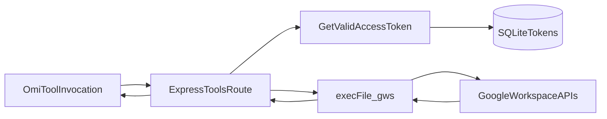

# Architecture

## Overview

The service is an Express app that bridges Omi chat tool calls to Google Workspace APIs through the `gws` CLI.

1. Users authenticate with Google via OAuth routes under `/auth/*`.
2. OAuth tokens are encrypted and stored per Omi `uid` in SQLite.
3. Omi calls tool endpoints under `/tools/*` (or `/auth/tools/*`).
4. The server refreshes tokens when needed and executes `gws` with `GOOGLE_WORKSPACE_CLI_TOKEN`.
5. Responses are formatted into user-friendly `{ result: "..." }` payloads.

## Components

- `src/index.ts`
  - Middleware stack (`json`, `tid`, logging, uid validation)
  - Route mounting (`/auth`, `/.well-known`, `/tools`, `/auth/tools`)

- `src/routes/auth.ts`
  - `GET /auth` login page
  - `GET /auth/login` OAuth redirect
  - `GET /auth/callback` token exchange + persistence
  - `GET /auth/status` setup polling endpoint

- `src/routes/chat-tools.ts`
  - Manifest builder for `/.well-known/omi-tools.json`
  - Gmail tools: `search_emails`, `read_email`, `send_email`, `list_labels`, `trash_email`
  - Calendar tools: `list_events`, `create_event`, `get_event`, `update_event`, `delete_event`

- `src/services/token-store.ts`
  - `better-sqlite3` access to `data/tokens.db`
  - AES-256-GCM encryption/decryption for token-at-rest security

- `src/services/auth.ts`
  - Google OAuth client initialization
  - Access token refresh workflow with per-call OAuth2 client

- `src/services/gws.ts`
  - Safe `execFile` wrapper for `gws` invocation
  - Timeout handling and JSON parsing

- `src/utils/logger.ts`
  - pino logger with request-scoped `tid`
  - stdout + daily file stream (`logs/YYYY-MM-DD.log`)

## Data Flow

## Security Notes

- UID format validated before token operations and tool execution.
- OAuth tokens encrypted at rest with `AES-256-GCM`.
- `execFile` used instead of `exec` to avoid shell injection.
- User-facing errors never expose raw stack traces or CLI stderr.
